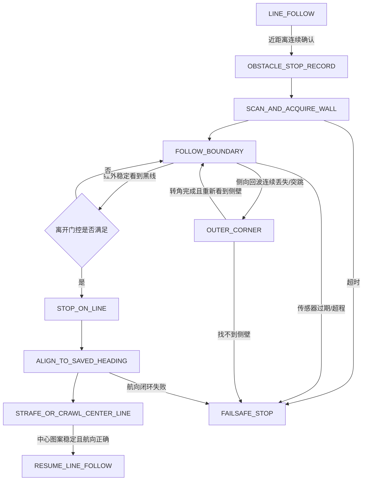

# 下一阶段：绕木板避障与定向回线方案

更新时间：2026-08-26

适用工程：`smart-car-test`

目标平台：ESP32-S3-DevKitC-1、三轮全向底盘、LQ-IR4CHV6、HC-SR04、三组 AB 编码器；建议加入套件已有的 MPU6500 和 MG90S。

## 1. 结论先行

当前代码中的“检测到近障碍后刹车，随后原地右转，前方距离变大就恢复巡线”不适合本题。木板只是离开了超声波的正前方，并不代表小车已经绕到木板另一侧；直接恢复巡线也没有位置和航向保证。

推荐方案是：

> **以黑线作为 Bug2 方法中的原行进线，以木板边界跟随作为绕障主体；在遇障瞬间保存原始前进航向，用编码器估计绕行进度，用 MPU6500 保持相对航向；只有“已经到达木板另一侧、黑线稳定出现、重新对准原始航向”三个条件同时成立，才允许恢复巡线。**

它不是单纯的“恒距离环绕”，而是四层判定：

1. **测距层**：区分有效距离、异常突跳、丢 Echo 和真正空旷。
2. **边界层**：沿同一侧跟随木板，丢失侧向回波时将其视为外角候选，由编码器和陀螺仪完成转角，而不是继续相信边缘距离。
3. **位置层**：用三轮编码器建立局部里程计，确认黑线候选位于初始碰障点的前方，而不是刚离开的原位置。
4. **方向层**：遇障时保存航向 `yaw_start`，重新遇线后先闭环转回该航向，再以低速重新居中；黑线本身没有方向，不能单靠四路红外判断正走还是反走。

## 2. 对题目的工作定义

本文按以下目标设计：

- 小车沿黑线正向行驶，黑线中途被木板覆盖或截断。
- 小车从木板一侧绕行，抵达木板另一侧重新出现的黑线。
- 重新上黑线后，继续沿遇障前的前进方向行驶，绝不反向。
- 木板尺寸和进入位置可以变化，但木板是单个、静止、可沿边界绕行的障碍物。

“绕木板一周”有两种可能解释：

- **通常的绕障含义**：绕到木板另一侧并继续原路线。此时应在远侧黑线处离开木板边界，相当于 Bug2 的离开点。
- **考核明确要求完整环绕 360°**：增加 `full_lap_required` 条件，累计转角达到约 360°、角点数达到 4 后仍继续边界跟随，直到再次到达满足“位于木板另一侧”的黑线。因为如果完整一圈后在原碰障点立即恢复原方向，小车会再次撞向木板，所以不能把“回到原碰障点”直接当作完成。

实现前应向老师确认是哪一种解释；软件状态机可以通过配置同时支持两者。

## 3. 本地项目现状与缺口

当前权威接线和实验结论见[项目开发与实验日志](项目开发与实验日志.md)，当前实现见[`main/main.c`](main/main.c)。已有能力包括三路电机、三组编码器、四路红外、非阻塞 HC-SR04 和 20 ms 巡线循环。

现有避障状态只有：

```text
CLEAR -> BRAKE -> TURN_RIGHT -> CLEAR
```

主要缺口：

- 没有木板边界跟随。
- 没有侧向距离或传感器扫描方向。
- 没有角点识别。
- 没有使用编码器判断是否已经越过木板。
- 没有保存遇障前航向。
- 没有区分初始黑线、远侧黑线和误检黑线。
- 没有重新上线路径和方向确认。
- B 后轮及三轮全向运动没有进入避障控制。

因此不应在现有 `TURN_RIGHT` 上继续增加时间常数，而应替换为独立的绕障状态机。

## 4. 资料结论及其对本项目的意义

### 4.1 木板边缘不能依赖单次超声波距离

TI 的 [Ultrasonic Sensing Basics](https://www.ti.com/lit/pdf/slaa907) 指出，平整目标在与传感器近似垂直时回波最强；倾斜面会把大部分声波反射到别处，目标形状和入射角都会显著影响回波。HC-SR04 的常见产品手册给出的有效角约小于 15°，例如这份 [HC-SR04 User Manual](https://www.gie.com.my/download/um/modules/sensor/um_hc_sr04.pdf)。

这说明木板边缘处可能出现三种现象：

- 波束只有一部分落在木板上，距离突然变大。
- 入射角变化后回波偏离接收头，直接超时。
- 回波跳到背景墙或其他物体，得到一个“看似有效但实际错误”的远距离。

所以本项目必须把 `timeout`、突跳和超量程定义成 **UNKNOWN/LOST**，而不是“前方安全”。在直边段可以对距离做中值滤波；进入边缘段后则以“稳定有效 -> 连续丢失/突跳”的变化作为外角事件。

超声波沿墙实验也表明，移动机器人经过外角时可能出现多路超声波同时变成最大距离，控制器必须显式执行外角转向，而不能把读数当普通距离误差。参见 [Mobile Robot Wall-Following Control Using Fuzzy Logic Controller](https://doi.org/10.3390/math8081254)。

### 4.2 采用 Bug2 思路，而不是“转到看不见障碍”

Lumelsky 和 Stepanov 的经典局部传感导航研究提出：机器人沿原目标线前进，碰到未知障碍后沿其边界运动，只有重新到达原目标线且新的位置更接近目标时才离开障碍边界。参见 [Dynamic Path Planning for a Mobile Automaton with Limited Information on the Environment](https://doi.org/10.1109/TAC.1986.1104175)。

本题不需要完整实现通用 Bug2，但可以直接采用它最有价值的结构：

- 黑线就是可被红外直接检测的 `m-line`。
- 木板首次被确认的位置是 `hit point`。
- 木板边界跟随替代当前的固定右转。
- 只有位于 `hit point` 前方的黑线才是允许离开的 `leave point`。

这比仅靠时间或距离更可靠，因为“回到线”与“已经越过障碍”是两个独立条件。

### 4.3 航向必须来自陀螺仪/里程计，而不是黑线

MPU6500 提供三轴角速度和三轴加速度，陀螺仪量程可配置，适合在数秒级绕障过程中保存相对转角，见 [TDK MPU-6500 Datasheet](https://invensense.tdk.com/wp-content/uploads/2020/06/PS-MPU-6500A-01-v1.3.pdf)。机器人控制实践中，陀螺仪闭环常用于稳定车体航向，尤其适合全向底盘，见 [WPILib Gyroscopes](https://docs.wpilib.org/en/stable/docs/software/hardware-apis/sensors/gyros-software.html)。

需要注意：MPU6500 没有磁力计，不能长期提供无漂移的绝对方位。本项目只需在碰障时把相对航向清零，在一次短绕障过程中使用，并用编码器转角交叉校验。

三轮全向车的轮速可以映射为车体 `vx、vy、omega`，编码器可反算局部位置和航向。三轮 120° 布局的运动学及编码器里程计示例可参考 [JAMRIS 三轮全向机器人研究](https://www.jamris.org/index.php/JAMRIS/article/download/737/683/2110)。但当前小车的轮子安装方向和电机正负号必须实车标定，不能直接照搬论文符号。

ESP-IDF 5.4.4 的 [PCNT 官方文档](https://docs.espressif.com/projects/esp-idf/en/v5.4.4/esp32s3/api-reference/peripherals/pcnt.html)明确支持 AB 相正交解码和毛刺过滤。后续宜把目前的 GPIO ISR 单边计数升级为 PCNT 正交解码，降低高速绕障时漏计数和噪声带来的里程误差。

### 4.4 红外负责“看见线”，航向负责“决定走哪边”

Pololu 的 [QTRSensors `readLineBlack()` 文档](https://pololu.github.io/qtr-sensors-arduino/class_q_t_r_sensors.html)使用加权平均获得单调的线位置，并保留最后看到线的一侧，适合丢线重捕获。当前项目已有类似的四路加权误差和方向锁存，可以继续用于居中。

但一条普通黑线在几何上没有箭头。小车以 `yaw_start` 或 `yaw_start + 180°` 压在线上时，四路横向红外都可能得到相同图案。因此“防止反向”不能靠红外图案解决，必须在重新上线前将车体闭环对准保存的 `yaw_start`。

## 5. 方案比较

| 方案 | 木板边缘鲁棒性 | 回线方向保证 | 硬件代价 | 结论 |
| --- | --- | --- | --- | --- |
| 当前固定右转、看到远距离就恢复 | 很差 | 无 | 无 | 淘汰 |
| 全程按固定时间走矩形 | 不依赖边缘测距，但受轮滑和木板尺寸影响 | 可保存朝向 | 无 | 仅作故障退化方案 |
| 单 HC-SR04 恒距沿墙，遇线即退出 | 边缘容易丢回波 | 无 | 无 | 不采用 |
| **HC-SR04+MG90S 扫描、编码器、MPU6500、条件式回线** | 中高；角点用事件和航向桥接 | 有 | 使用套件已有器件 | **当前主方案** |
| 前向 HC-SR04 + 固定侧向 ToF/第二超声波 + MPU6500 | 高，前/侧同时观测 | 有 | 增加一个传感器 | 允许加硬件时的推荐增强 |
| 摄像头/激光雷达建图 | 高 | 有 | 开发量大 | 当前阶段过度设计 |

### 5.1 主方案：使用现有套件

- HC-SR04 安装在 MG90S 上，至少支持“前向”和“右向”两个扫描角。
- 固定使用右手沿墙规则：木板始终保持在车体右侧；若机械布局更适合左侧，只需整体镜像，运行中不要随机换边。
- 直边跟随时传感器主要朝右；准备前进或处理角点时停车/减速并扫向前方。
- MPU6500 保存相对航向，三组编码器估计局部位移和绕行进度。
- 四路红外始终运行，但只有满足离开门控后才接受黑线。

MG90S 官方规格给出 4.8 V 下约 `0.10 s/60°`，且建议外部适配器供电，见 [TowerPro MG90S](https://towerpro.com.tw/product/mg90s-3/)。因此传感器转动 90° 本身约需 150 ms，另需机械稳定时间。单传感器方案必须低速，并采用“停稳—转舵机—等待—测量”的非阻塞子状态，不能一边高速行驶一边假设前向和侧向距离都在实时更新。

### 5.2 增强方案：增加固定侧向传感器

保留 HC-SR04 朝前，右侧增加一只固定测距传感器：

- 若增加第二个 HC-SR04，两只必须错时触发，避免串扰。
- 更推荐侧向使用 VL53L1X 模块；其接收 ROI 可以缩小视场，有利于减少木板边缘部分入射造成的混合测距，见 [ST VL53L1X](https://www.st.com/en/imaging-and-photonics-solutions/vl53L1X)。

增强方案允许前向碰撞保护和侧向沿墙同时工作，速度可高于舵机扫描方案，但仍然必须保留角点状态、里程门控和航向门控。

## 6. 建议的硬件调整

| 器件 | 建议连接 | 注意事项 |
| --- | --- | --- |
| HC-SR04 | Trig=GPIO6，Echo 到 GPIO13 | 当前模块使用 3.3 V 供电并已验证 Echo 可直接连接；若改为 5 V 供电则必须增加 Echo 分压；保持现有非阻塞捕获 |
| MG90S | PWM 选择一个空闲输出 GPIO；GPIO47 可作为候选 | 舵机使用独立稳定 4.8～5 V 电源并与 ESP32 共地，不从 3V3 供电；最终引脚需按实物板复核 |
| MPU6500 | 建议 I²C；GPIO43/44 可作为 SDA/SCL 候选 | GPIO41/42 已被 C 轮编码器占用；43/44 与本地未提交 UART0 诊断冲突，二者只能选一个 |
| 三组编码器 | 保持现有 E1/E2/E3 接线 | 软件建议迁移至 PCNT 正交解码并启用合适的毛刺过滤 |
| 可选 VL53L1X | 与 MPU6500 共用 I²C，总线地址不同 | 确认购买的是带稳压和电平处理的模块，不按裸芯片电压直接接线 |

Espressif 的 [ESP32-S3-DevKitC-1 引脚说明](https://docs.espressif.com/projects/esp-dev-kits/en/latest/esp32s3/esp32-s3-devkitc-1/)确认 GPIO43/44 和 GPIO47 都引出且属于 I/O；但不同开发板版本、现有 UART 调试和后续摄像头仍可能产生资源冲突，所以编码前必须完成一次整车 GPIO 审核。

## 7. 软件分层

不要继续把所有逻辑堆在 `update_obstacle_avoidance()` 中。建议拆成以下层次：

```text
传感器层：IR / ultrasonic / servo / MPU6500 / encoders
        ↓ 带时间戳、有效性和质量标记的数据
估计层：filtered_distance / yaw_relative / local_pose(x,y,theta)
        ↓
行为层：line follow / obstacle boundary FSM / line reacquisition
        ↓ 车体速度目标 vx, vy, omega
运动层：三轮逆运动学 / 单轮速度闭环 / 电机限幅
```

关键原则：行为层输出车体运动目标 `vx、vy、omega`，不要直接散落地写 A/B/C 三路 PWM。三轮运动学只在运动层进行一次映射，这样才能独立标定横移、前进和旋转。

## 8. 局部坐标与核心变量

障碍被确认并停车后建立一次性的局部坐标：

- 原点：首次碰障位置 `hit_pose`。
- `+X`：遇障前黑线前进方向。
- `+Y`：其左侧。
- `yaw_start = 0`：遇障前航向。

至少记录：

```c
typedef struct {
    float x_mm;
    float y_mm;
    float yaw_rad;          // 相对 yaw_start
    float turn_sum_rad;     // 不做 ±pi 折返的累计转角
    float boundary_mm;      // 沿木板边界累计行程
    int corner_count;
    int line_stable_count;
    bool line_exit_armed;
} avoid_context_t;
```

当前位置在原前进方向上的投影为：

```text
forward_progress = dot(position - hit_position, heading_at_hit)
```

它用于区分“原碰障点附近再次看到黑线”和“已经到达木板另一侧”。

## 9. 推荐状态机



### 9.1 `LINE_FOLLOW`

- 保留当前巡线算法。
- HC-SR04 连续 3 个新鲜样本小于障碍阈值才进入避障，避免单个异常回波触发。
- 触发后立即减速并停车，不直接转向。

### 9.2 `OBSTACLE_STOP_RECORD`

- 电机停止。
- 保存编码器计数、`yaw_start`、当前红外图案和碰障距离。
- MPU6500 在静止状态估计零偏，然后把本次任务相对 yaw 清零。
- 设置黑线退出锁定：在达到最小边界行程/角点数之前，任何黑线都只记录而不退出。

### 9.3 `SCAN_AND_ACQUIRE_WALL`

- 用舵机扫描前方和右方，确认木板大致方向。
- 按右手规则调整姿态，使木板位于右侧、侧向距离接近 `d_target`。
- 转角由陀螺仪闭环完成，时间只作最大超时，不作主要终止条件。

### 9.4 `FOLLOW_BOUNDARY`

- 低速沿木板直边前进。
- 距离误差：`e_d = d_side - d_target`。
- 用小幅 `omega` 或全向横移 `vy` 修正距离，同时用 yaw 闭环保持当前直边航向。
- 持续更新局部里程计、累计边界行程、红外图案和传感器新鲜度。
- 单舵机方案每隔若干侧向测量执行一次前向扫描；扫描期间减速或短暂停车。

### 9.5 `OUTER_CORNER`

进入条件不是某一个固定距离，而是：

- 之前连续获得稳定侧向距离；随后连续 2～3 个测量超时、超量程或突增；
- 前向保护没有发现即将碰撞；
- 已经走过最小直边距离，避免刚开始时误判。

动作：

1. 冻结最后可信侧向距离，不把远距离输入 PID。
2. 用编码器向前越过一个标定的小距离，使车体旋转中心通过木板角点。
3. 按右手规则闭环右转约 90°。
4. 扫描右侧，直到重新获得连续有效的侧壁距离。
5. `corner_count++`，进入下一段 `FOLLOW_BOUNDARY`。

这种方法把木板边缘的“测不准”转化为状态切换信号，角点期间主要依赖短时里程和相对 yaw。

### 9.6 黑线候选与离开门控

红外任意通道看到黑色时先进入候选，不立即恢复巡线。候选必须同时通过：

```text
line_stable          = 黑线连续出现 3～5 个 20 ms 周期
left_start_area      = 已超过初始黑线锁定距离/时间
far_side_progress    = forward_progress > progress_min
enough_boundary      = corner_count >= 2 且 boundary_mm > boundary_min
sensor_fresh         = 红外、yaw、编码器时间戳均有效
```

若课程要求完整一圈，再增加：

```text
full_lap_done = abs(turn_sum_rad) >= 330°～360° 且 corner_count >= 4
```

任一条件不满足都继续沿边界运动。`progress_min` 和 `boundary_min` 由木板最小尺寸、车体外廓和安全间隙实测确定，不直接写死为某个比赛场地专用时间。

### 9.7 `ALIGN_TO_SAVED_HEADING`

- 在黑线候选处停车。
- 目标航向固定为 `yaw_start`，而不是“选择更近的 0°/180° 黑线方向”。
- 用陀螺仪闭环旋转，直到 `abs(yaw_error) <= 8°～10°` 且角速度稳定。
- 将朝向 `yaw_start + 180°` 明确定义为错误，不允许直接进入巡线。

### 9.8 `STRAFE_OR_CRAWL_CENTER_LINE`

对准原航向后，利用全向底盘做低速横移搜索：

- 黑线偏左：保持 yaw 不变，向左横移。
- 黑线偏右：保持 yaw 不变，向右横移。
- 中间两路稳定看到黑线：小幅正向爬行并转入现有比例巡线。
- 超过最大横移距离仍未居中：退回黑线候选点附近重新扫描，最终进入安全停车。

横移可以在不改变车头方向的情况下居中，是三轮全向底盘解决“回线角度不确定”的关键优势。前提是先完成三轮横移运动组合和编码器符号标定。

## 10. 超声波数据处理规则

每个测距结果必须携带 `timestamp` 和状态：

```text
VALID       距离在物理范围内，Echo 新鲜，且与近期数据一致
OUTLIER     单次突跳，不进入距离控制
LOST        连续超时或超量程，可能是木板边缘
STALE       超过规定时间没有新样本
```

建议初始规则：

- 直边阶段使用 3 点中值，不用长窗口均值，以免把角点变化拖慢。
- 单次距离变化大于约 100～150 mm 时先标记候选异常，连续出现才转成 `LOST`；最终阈值由木板扫描实验确定。
- 需要 2～3 个连续状态确认，不由单次样本切换状态。
- `LOST` 不能等价于“安全”；只有已进入 `OUTER_CORNER` 并完成受控转角后才能继续。
- 距离数据过期、陀螺仪失效或编码器不更新时立即停车。

## 11. 航向和里程估计

### 11.1 MPU6500

- 上电后静止校准；每次进入避障前再次利用停车窗口估计 Z 轴零偏。
- 100～200 Hz 读取角速度并积分相对 yaw。
- 使用未折返的 `turn_sum` 统计完整环绕进度，另用 `wrapToPi()` 的 yaw 做姿态控制。
- 陀螺仪只负责一次短避障的相对航向，不将其当长期绝对罗盘。

### 11.2 三轮编码器

- 标定每个轮子的前进正方向、每圈有效计数、轮径和车体中心到轮轴距离。
- 建立三轮正/逆运动学矩阵，将轮速转换为 `vx、vy、omega`。
- 分别验证纯前进、纯横移、纯旋转，禁止用目前未标定的 `a/d` 组合替代。
- 初期可用陀螺 yaw 为主、编码器 yaw 为辅；编码器主要用于短距离和 `forward_progress`。
- 后续将三路速度改成每轮 PI/PID 闭环，避免仅靠相同 PWM 导致路线偏移。

## 12. 推荐初始参数（只作为台架起点）

| 参数 | 起始建议 | 说明 |
| --- | ---: | --- |
| 障碍确认 | 3 个连续新鲜样本 | 比当前 2 次更保守 |
| 障碍距离 | 200～250 mm | 根据刹车距离和车体前悬确定 |
| 直边目标间隙 `d_target` | 150～200 mm | 必须大于车体半宽和角点摆动余量 |
| 边界速度 | 100～180/1000 | 单舵机扫描时必须低速 |
| 距离中值窗口 | 3 个样本 | 保留角点响应速度 |
| 外角丢失确认 | 2～3 个样本 | 防止单次超时误触发 |
| 黑线稳定确认 | 3～5 个 20 ms 周期 | 60～100 ms |
| 直边航向误差 | 小于约 5° | 超出后减速修正 |
| 回线航向误差 | 小于 8°～10° | 满足后才能恢复巡线 |
| 角点目标转角 | 约 90° | 以陀螺/编码器结束，不以时间结束 |

所有数值都要通过实验日志重新确定，不能直接作为最终比赛参数。

## 13. 实施顺序

### 阶段 A：运动底座标定

1. 单轮正反转与编码器符号复核。
2. 标定三轮 `vx、vy、omega -> A/B/C` 映射。
3. 完成前进、横移、原地旋转三个闭环运动原语。
4. 将编码器迁移到 PCNT 或至少验证现有 ISR 在目标速度下无明显漏计数。

通过条件：10 次 300 mm 前进/横移和 10 次 90° 转向均无方向错误，记录平均误差和最大误差。

### 阶段 B：传感器台架实验

1. 验证 HC-SR04 5 V 供电和 Echo 分压。
2. 在 100、150、200、250、300 mm 处各记录至少 100 次距离。
3. 让波束从木板中心缓慢扫过边缘，记录原始距离、超时率和突跳幅度。
4. 分别测试垂直入射、15°、30°、45° 入射及木板正反两面。
5. 标定 MG90S 的实际 0°、右向角、动作时间和稳定等待时间。

输出：`VALID/OUTLIER/LOST` 阈值和舵机扫描时序。

### 阶段 C：航向实验

1. 测量 MPU6500 静止 30 s 的零偏和漂移。
2. 重复 20 次 90°、180°、360° 转向。
3. 比较陀螺 yaw 与编码器 yaw，确定互补权重和允许误差。

通过条件：单次避障预计时长内，最终航向误差足以稳定控制在 10°以内。

### 阶段 D：只沿木板、不找线

1. 完成直边跟随。
2. 完成单个外角。
3. 连续绕过两个外角。
4. 完成整块木板边界跟随和角点计数。

每个子阶段至少连续成功 20 次后再进入下一阶段。

### 阶段 E：定向回线

1. 在木板远侧单独铺设黑线，验证候选门控。
2. 从不同交叉角度遇线，验证小车都先转回 `yaw_start`。
3. 验证横移居中和低速接管巡线。
4. 专门以接近 180° 的姿态压线，确认状态机拒绝反向恢复。

### 阶段 F：完整场景

覆盖以下组合：

- 木板与黑线垂直、略有偏角。
- 小车从线中心、偏左、偏右接近。
- 多种起始速度和电池电压。
- 木板正反面、不同现场光照。
- 超声波偶发超时、单次假远距离。

建议验收标准：至少 30 次完整试验中，无碰撞、无反向巡线、无无限状态；回线成功率达到 95% 以上，再逐步提升速度。

## 14. 必须记录的日志

```text
t, state, state_age
IR[L,LC,RC,R], line_stable, line_exit_armed
ultra_raw, ultra_filtered, ultra_status, ultra_age, servo_angle
gyro_z, yaw, yaw_error, turn_sum
encoder[A,B,C], wheel_speed[A,B,C]
pose[x,y,theta], forward_progress, boundary_mm, corner_count
body_cmd[vx,vy,omega], motor_cmd[A,B,C]
transition_reason, reject_reason, failsafe_reason
```

日志应在状态切换时立即打印，并另以 10～20 Hz 输出紧凑监控行。没有 `transition_reason` 和 `reject_reason`，现场很难判断是超声波、里程计、航向还是红外门控导致失败。

## 15. 故障安全

出现以下任一条件必须停车，而不是按超时强行恢复巡线：

- 前向距离小于紧急阈值。
- 超声波、MPU6500 或编码器数据过期。
- 电机有命令但编码器长期不变化。
- 边界行程、状态持续时间或角点数量超过合理上限。
- 回线后航向无法收敛。
- 黑线候选反复出现但始终不满足远侧门控。

允许串口命令手动退出避障并停车；保留 BOOT/`x` 急停能力。

## 16. 最终实施建议

优先顺序不是先写完整绕障代码，而是：

1. 标定三轮全向运动和编码器里程。
2. 接入 MPU6500，解决“方向无法从黑线判断”的根本问题。
3. 测出 HC-SR04 在真实木板边缘的失效特征。
4. 用 MG90S 实现低速前/侧扫描和单角点状态。
5. 完成边界跟随及两个角点。
6. 最后加入远侧黑线门控、航向对齐和横移居中。

其中最重要的设计约束是：

> **超声波只负责提供局部边界信息，不能单独决定“绕障完成”；红外只负责确认存在黑线，不能单独决定行驶方向；绕障完成必须由边界进度、局部位置、黑线和保存航向共同判定。**

## 17. 主要资料

1. V. J. Lumelsky and A. A. Stepanov, [Dynamic Path Planning for a Mobile Automaton with Limited Information on the Environment](https://doi.org/10.1109/TAC.1986.1104175), IEEE Transactions on Automatic Control, 1986.
2. Texas Instruments, [Ultrasonic Sensing Basics](https://www.ti.com/lit/pdf/slaa907), SLAA907D.
3. HC-SR04, [Ultrasonic Module User Manual](https://www.gie.com.my/download/um/modules/sensor/um_hc_sr04.pdf).
4. Cheng-Hung Chen, Shiou-Yun Jeng, and Cheng-Jian Lin, [Mobile Robot Wall-Following Control Using Fuzzy Logic Controller with Improved Differential Search and Reinforcement Learning](https://doi.org/10.3390/math8081254), Mathematics, 2020.
5. TDK InvenSense, [MPU-6500 Product Specification](https://invensense.tdk.com/wp-content/uploads/2020/06/PS-MPU-6500A-01-v1.3.pdf).
6. Pololu, [QTRSensors `readLineBlack()`](https://pololu.github.io/qtr-sensors-arduino/class_q_t_r_sensors.html).
7. Espressif, [ESP-IDF 5.4.4 Pulse Counter (PCNT)](https://docs.espressif.com/projects/esp-idf/en/v5.4.4/esp32s3/api-reference/peripherals/pcnt.html).
8. Espressif, [ESP32-S3-DevKitC-1 User Guide](https://docs.espressif.com/projects/esp-dev-kits/en/latest/esp32s3/esp32-s3-devkitc-1/).
9. TowerPro, [MG90S Specifications](https://towerpro.com.tw/product/mg90s-3/).
10. STMicroelectronics, [VL53L1X Product and ROI Information](https://www.st.com/en/imaging-and-photonics-solutions/vl53L1X).
11. Pan-Long Wu, Jyun-Jhen Li, and Jin-Siang Shaw, [Development of an Omnidirectional AGV by Applying ORB-SLAM for Navigation Under ROS Framework](https://doi.org/10.14313/JAMRIS/1-2022/2), Journal of Automation, Mobile Robotics and Intelligent Systems, 2022；其中第 2.1 节给出三轮 120° 运动学和编码器里程计。
